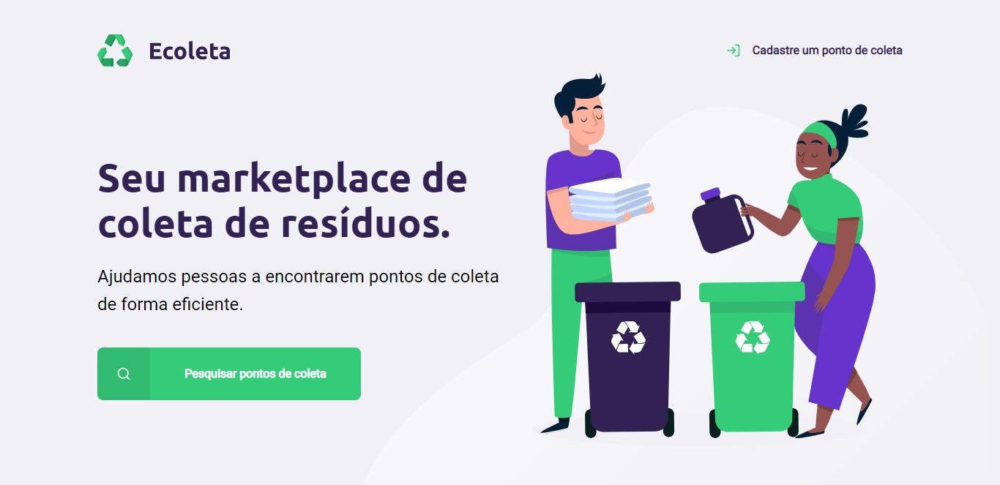

<h1 align="center">
    
</h1>

## :bookmark: Sobre

O <strong>Ecoleta</strong> é um projeto Open Source desenvolvido na semana Next Level Week (1.0) da Rocketseat (https://rocketseat.com.br/) e ministrado por Mayk Brito. 

## 🚀 Tecnologias

Esse projeto foi desenvolvido com as seguintes tecnologias:

- [Node.js](https://nodejs.org/en/)
- [Express](https://expressjs.com/pt-br/)
- [SQLite](https://www.sqlite.org/index.html)
- [Nunjucks](https://mozilla.github.io/nunjucks/)

## 💻 Projeto

O Ecoleta é um marketplace que ajudar pessoas a encontrarem pontos de coleta de resíduos de forma eficiente. 

## 🔖 Layout

Você pode visualizar o layout do projeto através [desse link](<https://www.figma.com/file/Byw4X5etg8VCmezueyhzkC/Ecoleta-(Starter)?node-id=136%3A546>). Lembrando que você precisa ter uma conta no [Figma](http://figma.com/) para acessá-lo

## :memo: License

Esse projeto está sob a licença MIT. Veja o arquivo [LICENSE](LICENSE.md) para mais detalhes.

---

<h4 align="center">
    Feito com 💜 by <a href="https://www.linkedin.com/in/luciana-d-guimaraes/" target="_blank">Luciana Duarte Guimarães</a>
</h4>

